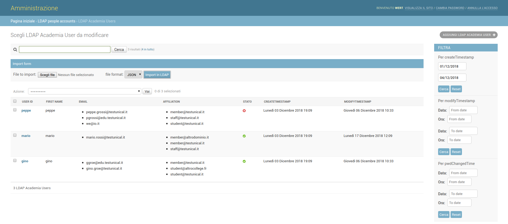
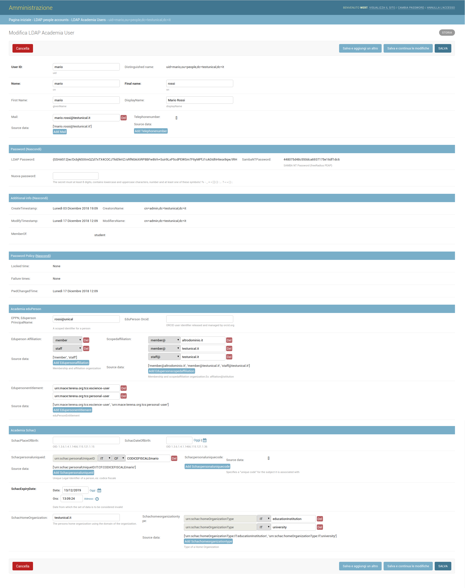

Django admin LDAP manager for Academia OU
-----------------------------------------
Django Admin manager for Academia Users, usable with an OpenLDAP Server configured with eduPerson, SCHAC (SCHema for ACademia) and Samba schema. It also needs PPolicy overlay and some other schemas as described as follow.

References
----------

- [OpenLDAP compatible configuration](https://github.com/peppelinux/ansible-slapd-eduperson2016)
- [eduPerson Schema](https://software.internet2.edu/eduperson/internet2-mace-dir-eduperson-201602.html)
- [SCHAC](https://wiki.refeds.org/display/STAN/SCHAC)

Requirements
------------

- OpenLDAP 2.4.x
- Python 3.x
- Django 2.x
- django-ldapdb (custom repository)


Tested on Debian9 and Debian 10.

Preview
-------

**Note:** Labels and strings can be localized with .po dictionaries (gettext). See [i18n documentation](https://docs.djangoproject.com/en/dev/topics/i18n/translation/)




LDAP Setup
-----
For those who need to setup a LDAP server for development or production use:
````
pip3 install ansible
git clone https://github.com/peppelinux/ansible-slapd-eduperson2016.git
cd ansible-slapd-eduperson2016
ansible-playbook -i "localhost," -c local playbook.yml
````
**Note:** The playbook will backup any existing slapd installations in **backups** folder.

Setup
-----

#### Create an virtual environment and activate it
````
pip3 install virtualenv

export PROJ_NAME=django-ldap-academia-ou-manager
export DEST_DIR=$PROJ_NAME.env
virtualenv -p python3 $DEST_DIR
source $DEST_DIR/bin/activate
pip3 install django
````

#### Install dependencies
````
apt install python3-dev python3-pip python3-setuptools
apt install libsasl2-dev python-dev libldap2-dev libssl-dev
pip install git+https://github.com/peppelinux/django-ldapdb.git
pip install git+https://github.com/peppelinux/pySSHA-slapd.git
pip install pycountry
pip install git+https://github.com/silentsokolov/django-admin-rangefilter.git
pip install git+https://github.com/peppelinux/django-ldap-academia-ou-manager.git
````

#### Create a project
````
django-admin startproject $PROJ_NAME
cd $PROJ_NAME
````

#### Install the app
**Note:** It uses a django-ldapdb fork to handle readonly (non editable) fields.

````
# pip3 install git+https://github.com/peppelinux/django-ldapdb.git
pip3 install git+https://github.com/peppelinux/django-ldap-academia-ou-manager
````

#### Edit settings.py
Read settings.py and settingslocal.py in the example folder.

In settings.py do the following:

- Add *ldap_peoples* in INSTALLED_APPS;
- Add *rangefilter* in INSTALLED_APPS;
- import default ldap_peoples settings as follows;
- import default app url as follows;

#### import default ldap_peoples settings
````
# settings.py
if 'ldap_peoples' in INSTALLED_APPS:
    from ldap_peoples.settings import *
````
#### import default app url
````
# urls.py
if 'ldap_peoples' in settings.INSTALLED_APPS:
    import ldap_peoples.urls
    urlpatterns += path('', include(ldap_peoples.urls, namespace='ldap_peoples')),
````

Using the Object Relation Mapper
--------------------------------
One of the advantage of using the ORM is the possibility to make these kind of queries
to a LDAP database.

#### User update attributes
````
from ldap_peoples.models import LdapAcademiaUser
lu = LdapAcademiaUser.objects.get(uid='mario')

# as multivalue
lu.eduPersonAffiliation.append('alumn')
lu.save()

lu.set_password('secr3tP4ss20rd')

# search into multivalue field
other_lus = LdapAcademiaUser.objects.filter(mail_contains='unical')

````

#### User creation example
````
# user creation
import datetime

d = {'cn': 'pedppe',
     'displayName': 'peppde Rossi',
     'eduPersonAffiliation': ['faculty', 'member'],
     'eduPersonEntitlement': ['urn:mace:terena.org:tcs:escience-user',
      'urn:mace:terena.org:tcs:personal-user'],
     'eduPersonOrcid': '',
     'eduPersonPrincipalName': 'grodsfssi@unical',
     'eduPersonScopedAffiliation': ['member@testunical.it', 'staff@testunical.it'],
     'givenName': 'peppe',
     'mail': ['peppe44.grossi@testunical.it', 'pgros44si@edu.testunical.it'],
     'sambaNTPassword': 'a2137530237ad733fdc26d5d7157d43f',
     'schacHomeOrganization': 'testunical.it',
     'schacHomeOrganizationType': ['educationInstitution', 'university'],
     'schacPersonalUniqueID': ['urn:schac:personalUniqueID:IT:CF:CODICEFISCALEpe3245ppe'],
     'schacPlaceOfBirth': '',
     'sn': 'grossi',
     'telephoneNumber': [],
     'uid': 'perrrppe',
     'userPassword': '{SHA512}oMKZtxqeWdXrsHkX5wYBo1cKoQPpmnu2WljngOyQd7GQLR3tsxsUV77aWV/k1x13m2ypytR2JmzAdZDjHYSyBg=='}

u = LdapAcademiaUser.objects.create(**d)
u.delete()
````

#### Unit test
````
./manage.py test ldap_peoples.tests.LdapAcademiaUserTestCase
````

TODO
----
 - form .clean methods could be cleaned with a better OOP refactor on FormFields and Widgets;


 **Django-ldapdb related**
 - We use custom django-ldapdb fork because readonly fields like createTimestamps and other are fautly on save in the official django-ldapdb repo. [See related PR](https://github.com/django-ldapdb/django-ldapdb/pull/185);
 - ListFields doesn't handle properly **verbose_name**. It depends on the form class, we use our fork for elude this;
 - Aggregate lookup for evaluating min max on records, this come from django-ldapdb;
